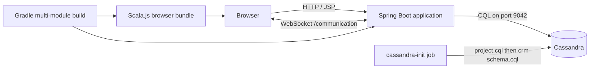

# Website Chat

Website Chat is a JVM-first, full-stack communication application built around real-time conversations, account management, administrative moderation, and a Cassandra-backed data model. The repository also contains the beginnings of a CRM data layer for organizations, contacts, leads, deals, tasks, activities, and teams.

The current product is best understood as an actively developed chat platform and JVM web-technology laboratory rather than a production-ready service. Its primary working path is the Spring Boot/JSP/Scala.js application. A separate Kotlin Multiplatform/Kobweb authentication UI is experimental and is not part of the main Docker Compose runtime.

## Project goals

- Provide authenticated, browser-based real-time chat.
- Support a shared Global Chat and user conversation channels.
- Persist users, roles, conversations, messages, events, and CRM records in Cassandra.
- Provide administrator-controlled account verification and message moderation.
- Keep application implementation within a JVM-oriented technology stack.
- Explore JVM languages across server and browser targets without adopting a conventional JavaScript application framework.
- Support reproducible local startup through Gradle and Docker Compose.

## JVM-first restriction

Application source should remain in JVM ecosystem languages and frameworks:

- Java for the Spring Boot server and persistence layer.
- Scala compiled through Scala.js for the primary browser behavior.
- Kotlin Multiplatform and Compose HTML/Kobweb for the experimental authentication UI.
- Gradle for the multi-module build.

Scala.js and Kotlin/JS generate JavaScript because browsers execute JavaScript, but the maintained application source remains Scala or Kotlin. Node.js and npm packages may be downloaded automatically as build tools for these browser targets; they are not the primary application platform. Small JSP scripts and externally loaded browser libraries currently exist and should be treated as legacy or integration code rather than the preferred direction for new application logic.

## Current functionality

Implemented or substantially implemented:

- User registration and JSON-based login.
- Session-backed authentication.
- Logout and 30-minute servlet session timeout.
- Role lookup and administrator-only routes.
- Account verification by an administrator.
- Shared Global Chat.
- Conversation navigation and persisted message history.
- Real-time message delivery over WebSockets.
- Message deletion by the author or an administrator.
- Cassandra-backed event and unread-event models.
- Cassandra schema foundations for CRM records.

Incomplete or experimental:

- Friend/conversation creation constructs a conversation but does not currently persist it.
- Forgot-password submission returns HTTP `501 Not Implemented`.
- The `/account` controller view is unfinished.
- The Kotlin/Kobweb authentication service is separate from the primary application flow.
- CRM schema tables exist, but corresponding application services and UI are not yet implemented.
- Automated test coverage is not currently present.

## Technology stack

| Area | Technology |
|---|---|
| Runtime | Java 21 |
| Build | Gradle Wrapper 9.2.0 |
| Server | Spring Boot 3.5.5 |
| HTTP/MVC | Spring Web MVC, Jakarta Servlet, embedded Tomcat |
| Server-rendered UI | JSP and JSTL |
| Primary browser code | Scala 3.7.3 and Scala.js 1.20.1 |
| Browser interop | scalajs-dom and Udash jQuery wrappers |
| Experimental UI | Kotlin Multiplatform 2.4.0, Kobweb 0.25.0, Compose HTML |
| Database | Apache Cassandra 4.1.7 |
| Live messaging | Jakarta WebSocket |
| Password hashing | jBCrypt 0.4 |
| Styling | Tailwind browser CDN and Font Awesome CDN in the current JSP UI |
| Packaging | Executable Spring Boot WAR |
| Containers | Docker and Docker Compose |

## Architecture



The Compose startup order is:

1. `cassandra` starts and passes its CQL health check.
2. `cassandra-init` applies the chat schema followed by the CRM schema, then exits with status `0`.
3. `app` starts only after Cassandra is healthy and initialization succeeds.

An exited `cassandra-init` container is expected. It is a one-time job for each Compose invocation, not a second database server.

## Repository layout

```text
Website_Chat/
├── backend/                 Java Spring Boot controllers, services, models, and repositories
├── frontend/                JSP views, Spring configuration, and executable WAR packaging
├── scala_js/                Scala.js source for primary browser behavior
├── auth_service/kt_service/ Experimental Kotlin/Kobweb authentication UI
├── cassandra/               Cassandra image, schemas, and CRM query documentation
├── Dockerfile               Multi-stage Java 21 application image
├── docker-compose.yml       Cassandra, schema initializer, and application services
├── build.gradle             Root convenience tasks
└── settings.gradle          Gradle module declarations
```

### Gradle modules

`backend`
: Contains the Spring Boot entry point, MVC and REST controllers, WebSocket endpoint, authentication filter, Cassandra entities and repositories, services, and persistence converters.

`frontend`
: Depends on `backend`, contains JSP pages and runtime configuration, and packages the executable WAR. Its `bootRun` and `bootWar` tasks link Scala.js first.

`scala_js`
: Compiles Scala browser code and copies generated `main.js` assets into `frontend/src/main/webapp/static/js`. Generated `.js` and `.js.map` files should generally not be edited manually.

`auth_service:kt_service`
: Experimental Kobweb application with a Kotlin/JS login page. It is available through the root `runAuth` task but is not included as a Compose service.

## Prerequisites

For the recommended all-container workflow:

- Docker Desktop or another Docker Engine with Docker Compose v2.
- At least several gigabytes of free memory; Cassandra is comparatively memory intensive.
- Internet access on the first build to download container images and Gradle dependencies.

For local JVM development:

- JDK 21.
- Docker for the recommended local Cassandra instance.
- No system Gradle installation is required; use the included wrapper.

On Windows, commands below use PowerShell and `gradlew.bat`. On Linux or macOS, replace `gradlew.bat` with `./gradlew`.

## Quick start with Docker Compose

Build and start the complete stack from the repository root:

```powershell
docker compose up -d --build
```

The initial build can take several minutes because it downloads Java, Gradle, Scala.js, Node, and Cassandra dependencies.

Open:

- Application: <http://localhost:8080>
- Cassandra native protocol: `localhost:9042`

Inspect service state:

```powershell
docker compose ps -a
```

Expected state after startup:

- `cassandra`: running and healthy.
- `cassandra-init`: exited with code `0`.
- `app`: running.

Follow application logs:

```powershell
docker compose logs -f app
```

Follow Cassandra and schema initialization logs:

```powershell
docker compose logs -f cassandra cassandra-init
```

Stop the services while retaining database data:

```powershell
docker compose down
```

Stop the services and permanently delete the Compose-managed Cassandra data:

```powershell
docker compose down --volumes
```

The second command is destructive. Use it only when intentionally resetting the development database.

## Local development workflow

For faster server-side iteration, run Cassandra in Docker and the Spring Boot application from Gradle on the host.

Start Cassandra and apply both schemas:

```powershell
docker compose up -d cassandra cassandra-init
```

If the containerized application is already running, stop it so port `8080` is available:

```powershell
docker compose stop app
```

Run the primary application:

```powershell
.\gradlew.bat :frontend:bootRun
```

The root convenience task is equivalent:

```powershell
.\gradlew.bat runApp
```

The local application connects to `localhost:9042`. Code running inside Compose connects to the service hostname `cassandra:9042`. A host process should not use generated container names such as `website_chat-cassandra-1`.

### Build without running

Compile the Scala.js bundle and package the executable WAR:

```powershell
.\gradlew.bat :frontend:bootWar
```

The output is written under:

```text
frontend/build/libs/
```

Build only the application image:

```powershell
docker compose build app
```

Validate the resolved Compose configuration:

```powershell
docker compose config
```

### Experimental Kotlin/Kobweb UI

Run the experimental authentication project separately:

```powershell
.\gradlew.bat runAuth
```

Its Kobweb configuration currently uses port `8443`. This module is not required to run the Spring Boot chat application.

## Configuration

The primary configuration file is `frontend/src/main/resources/application.yml`.

| Environment variable | Local default | Purpose |
|---|---:|---|
| `CASSANDRA_CONTACT_POINTS` | `localhost` | Cassandra host for a host-run application |
| `CASSANDRA_PORT` | `9042` | Cassandra native protocol port |
| `CASSANDRA_KEYSPACE_NAME` | `mykeyspacename` | Application keyspace |
| `CASSANDRA_LOCAL_DATACENTER` | `datacenter1` | Driver local datacenter |
| `CASSANDRA_SCHEMA_ACTION` | `NONE` | Spring Data schema behavior |

Compose supplies equivalent `SPRING_CASSANDRA_*` properties and changes the contact point to the internal `cassandra` service hostname.

Schema creation intentionally belongs to `cassandra-init`, so Spring Data uses `schema-action: NONE`. Do not enable automatic table creation while the CQL scripts own the schema; the message projection is a materialized view and can otherwise collide with Spring's table creation logic.

## Cassandra data model

The database uses the `mykeyspacename` keyspace with a single `datacenter1` replica for local development.

### Chat and account schema

`cassandra/project.cql` owns:

- User accounts and credentials.
- Global roles and user-role assignments.
- Conversations and participants.
- Messages.
- Events, event-by-type projections, and unread events.
- The `messages_by_conversation_id` materialized view.
- Seed records for Global Chat and the Admin, Moderator, and User roles.

The custom Cassandra image enables materialized views because Cassandra 4.1 disables their creation by default. Materialized views remain an experimental Cassandra feature and should be reassessed before production deployment.

Record statuses are stored as display values such as `Active` and `Disabled`. Registered Spring Data converters map those values to and from `RecordStatus.ACTIVE` and `RecordStatus.DISABLED`.

### CRM schema

`cassandra/crm-schema.cql` adds denormalized tables for:

- Organizations.
- Contacts.
- Leads.
- Pipelines and stages.
- Deals.
- Tasks.
- Notes and activities.
- Teams and memberships.

`workspace_id` is the CRM tenant boundary. Cassandra projections must be maintained explicitly: when a field used in a projection primary key changes, application code must delete the old projection row and insert the replacement. See `cassandra/CRM_SCHEMA.md` and `cassandra/crm-query-examples.cql` for model rules and example queries.

### Inspecting Cassandra

Open an interactive CQL shell:

```powershell
docker compose exec cassandra cqlsh
```

Useful commands:

```sql
DESCRIBE KEYSPACES;
USE mykeyspacename;
DESCRIBE TABLES;
SELECT * FROM conversations;
SELECT * FROM roles;
```

## HTTP and WebSocket surface

Important routes currently include:

| Method | Path | Purpose |
|---|---|---|
| `GET` | `/` | Authenticated landing page |
| `GET` | `/global-chat` | Redirect to the seeded Global Chat |
| `GET` | `/conversations?conversationId=...` | Render a conversation and message history |
| `GET` | `/account/login` | Login page |
| `POST` | `/account/login` | JSON login request |
| `GET/POST` | `/account/register` | Registration page and submission |
| `POST` | `/account/logout` | Invalidate the current session |
| `POST` | `/account/roles` | Return current user roles |
| `GET/POST` | `/account/forgot-password` | Page; submission is not implemented |
| `GET` | `/message` | Load older conversation messages |
| `DELETE` | `/message/delete` | Soft-delete a message |
| `POST` | `/add-friend` | Experimental direct-conversation creation |
| `GET` | `/admin` | Administrator page |
| `POST` | `/admin/user/verify` | Verify an account |
| WebSocket | `/communication` | Send and receive live conversation messages |

The authentication filter allows account and static-resource routes without a session, restricts `/admin` to the Admin role, and prevents pending accounts from using message endpoints.

## Authentication and authorization model

- Login verifies a bcrypt password and stores the `User` in the HTTP session as `current_user`.
- Browser sessions expire after 30 minutes according to `web.xml`.
- Roles are stored separately in Cassandra and attached to the user model.
- Administrative HTTP routes are checked by the servlet filter.
- Message deletion is allowed for the original author or an administrator.
- New accounts require administrator verification before message operations are allowed.

This is a custom authentication system, not Spring Security. That distinction matters for production hardening.

## Development conventions

- Use Java 21 language and runtime compatibility.
- Keep application logic in Java, Scala, or Kotlin according to the JVM-first constraint.
- Prefer constructor injection in new Spring components.
- Treat CQL schema files as the source of truth for database structure.
- Make schema scripts safe to rerun where Cassandra supports `IF NOT EXISTS`.
- Use stable primary keys for seed records to avoid duplicates.
- Register explicit Spring Data converters when persisted text differs from Java enum names.
- Do not edit `frontend/src/main/webapp/static/js/main.js` or its source map directly; edit `scala_js/src/main/scala` and run the Scala.js link task.
- Preserve Cassandra query-first modeling. Add projection tables for required access patterns instead of relying on broad `ALLOW FILTERING` queries.
- Never commit credentials, production secrets, or environment-specific `.env` files.

## Troubleshooting

### Application cannot connect to Cassandra during `bootRun`

Use `localhost:9042`, not `cassandra` or `website_chat-cassandra-1`. Confirm the database is running:

```powershell
docker compose up -d cassandra cassandra-init
docker compose ps -a
```

### Port 8080 is already in use

The local Gradle application and Compose application both use port `8080`. Run only one:

```powershell
docker compose stop app
```

Alternatively, override the local server port for one run:

```powershell
.\gradlew.bat :frontend:bootRun --args="--server.port=8081"
```

### Port 9042 is already in use

Another Cassandra container or local installation is publishing the same port. Inspect containers:

```powershell
docker ps -a
```

Stop the conflicting service or change the host-side port mapping. If the host port changes, update `CASSANDRA_PORT` for host-run development; containers still use Cassandra's internal port `9042`.

### `cassandra-init` exited

`Exited (0)` is success. Any other exit code indicates a schema failure:

```powershell
docker compose logs cassandra-init
```

### `No enum constant ... RecordStatus.Active`

Cassandra stores `Active`, while the Java enum constant is named `ACTIVE`. The project includes and registers read/write converters for this representation. Ensure `CassandraConversionConfig` is present in the Spring component scan and rebuild stale application artifacts.

### Schema changed but the existing database did not

`CREATE TABLE IF NOT EXISTS` does not alter an existing table. Apply an explicit CQL migration or reset disposable development data:

```powershell
docker compose down --volumes
docker compose up -d --build
```

Do not delete a volume that contains data you need.

### View generated or stale browser code

Relink Scala.js:

```powershell
.\gradlew.bat :scala_js:link
```

The link task copies its output into the frontend static assets directory.

## Security and production-readiness notes

Before exposing this application publicly, address at least the following:

- Replace or substantially harden the custom authentication layer, ideally using Spring Security.
- Authenticate WebSocket handshakes with the active HTTP session or a short-lived signed token. The current endpoint accepts user and conversation identifiers in query parameters and performs only conversation-membership checks.
- Add CSRF protection for state-changing HTTP requests.
- Validate and constrain message and form payloads consistently.
- Avoid returning exception details and stack traces outside local development.
- Replace CDN-loaded frontend dependencies with pinned, integrity-checked build artifacts where appropriate.
- Configure Cassandra authentication, authorization, TLS, backups, and a production replication strategy.
- Reassess Cassandra materialized-view use and `ALLOW FILTERING` queries under realistic load.
- Add rate limiting, structured logging, audit logging, metrics, and health endpoints.
- Add automated unit, integration, repository, WebSocket, and browser tests.
- Move schema evolution from bootstrap scripts to versioned migrations before retaining production data.
- Review password-reset, account-verification, session-cookie, and API-token lifecycle behavior.

The supplied Compose topology is intended for local development. It exposes Cassandra directly on the host, uses a single Cassandra node, has no database authentication, and contains no production secret management.

## Suggested roadmap

1. Add automated tests and CI for `:frontend:bootWar`.
2. Adopt Spring Security for HTTP sessions, roles, CSRF, and WebSocket identity.
3. Complete direct-conversation persistence and account error handling.
4. Implement email-backed verification and password recovery.
5. Decide whether JSP/Scala.js or Kobweb will be the long-term frontend architecture.
6. Introduce versioned Cassandra migrations.
7. Build services and UI for the existing CRM schema.
8. Add observability and production deployment profiles.

## License

No license file is currently included. Unless the repository owner adds one, assume the source is not licensed for redistribution or reuse outside the permissions explicitly granted by the owner.
